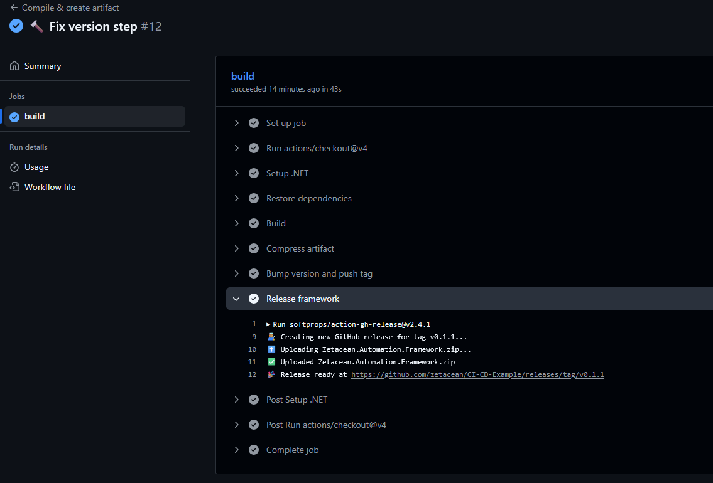
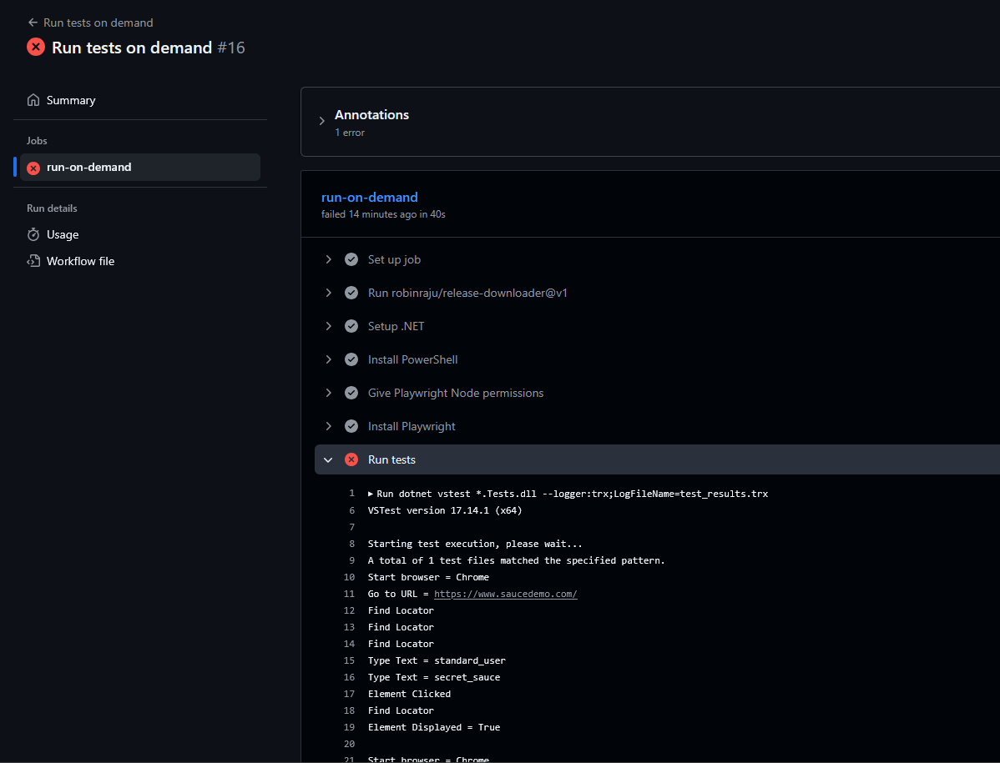

# Ejemplo de CI/CD para QA Automation

Este repositorio es un ejemplo para entender cómo implementar el flujo de **CI/CD** en los artefactos generados desde el código fuente. En este caso, se utiliza un framework de automatización de pruebas desarrollado en **C# con Playwright**.

## Continuous Integration (CI)

La **integración continua (CI)** es la práctica de integrar frecuentemente los cambios de código en la rama principal de un repositorio compartido, ejecutar pruebas automáticas y compilar el código de manera automática. Esto permite identificar y solucionar errores y problemas de seguridad de forma temprana en el proceso de desarrollo.

## Continuous Delivery (CD)

La **entrega continua (CD)** complementa a la CI y automatiza el aprovisionamiento de infraestructura y el despliegue de aplicaciones. En nuestro caso, permite consumir los artefactos generados para ejecutar pruebas automatizadas o realizar despliegues.

## Caso de uso

Supongamos que trabajamos bajo un modelo de ramas ([Git Flow](https://www.atlassian.com/es/git/tutorials/comparing-workflows/gitflow-workflow)). Antes de fusionar cambios en la rama principal, es necesario validar que el código cumpla con las **convenciones y reglas** establecidas por el lenguaje o por el equipo de desarrollo (en este caso, el equipo de QA Automation).

Si el análisis es exitoso, se generará un **artefacto**, que luego se utilizará para ejecutar las pruebas automatizadas. Esta etapa se ejecuta dentro del **pipeline de CI**.

Una vez que el artefacto está compilado, puede ser consumido desde otro pipeline correspondiente a la etapa de **CD**, donde se realiza la ejecución de pruebas automatizadas o cualquier otro despliegue necesario.

## Estructura del proyecto
```text  
├───📁.github
│   └───📁workflows
│           🗎 .run-tests-on-demand.yml ⚡ Pipeline para ejecutar las pruebas a demanda
│           🗎 dotnet.yml ⚡ Pipeline de compilación
├───📁Zetacean.Automation.Framework.Core ⚡ Componentes del framework de pruebas
└───📁Zetacean.Automation.Framework.Tests ⚡ Pruebas que ejecuta el framework
```

## Resultados
### [Pipeline de creación del release/artefacto](https://github.com/zetacean/CI-CD-Example/actions/runs/18638486183/job/53133154701)


### [Pipeline de ejecución de pruebas a demanda](https://github.com/zetacean/CI-CD-Example/actions/runs/18638504075/job/53133197105)


## Referencias
- [GitLab - ¿Qué es la CI/CD?](https://about.gitlab.com/es/topics/ci-cd/)
